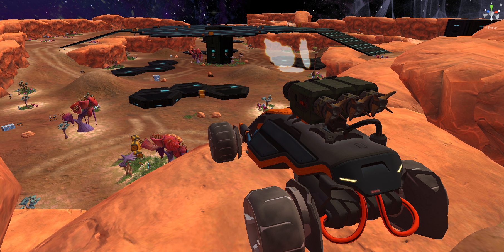
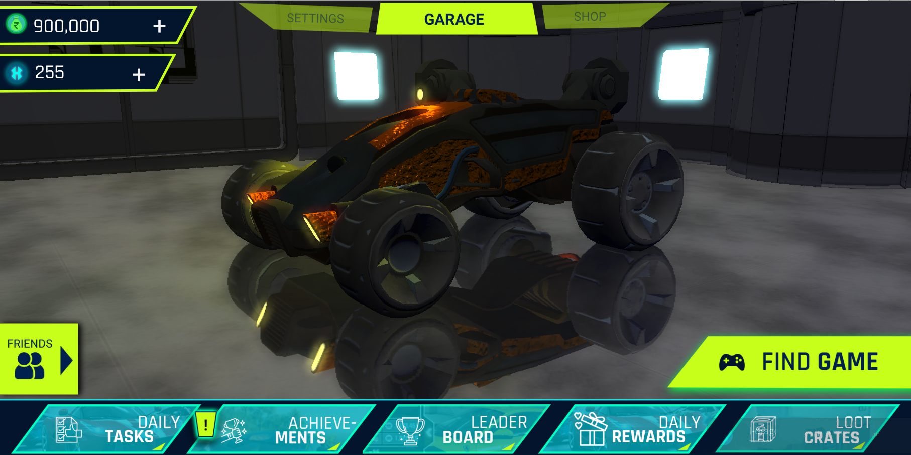
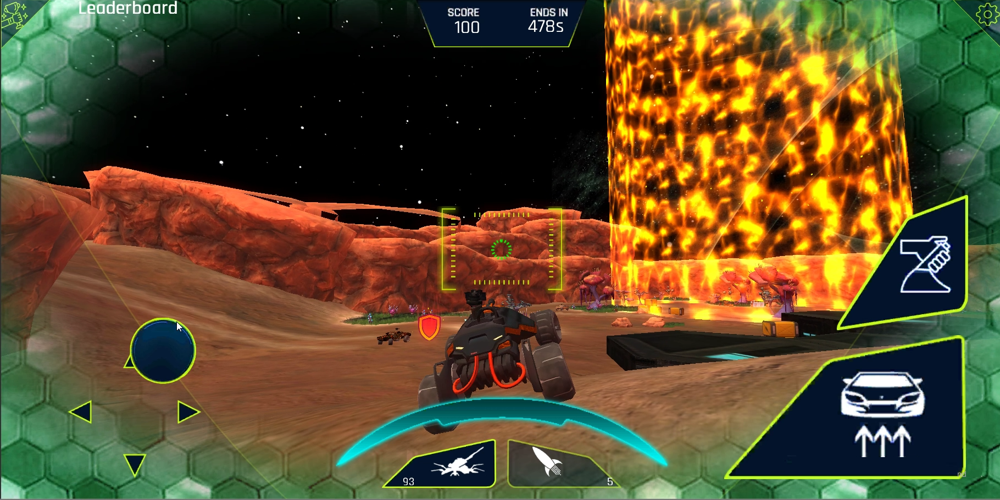
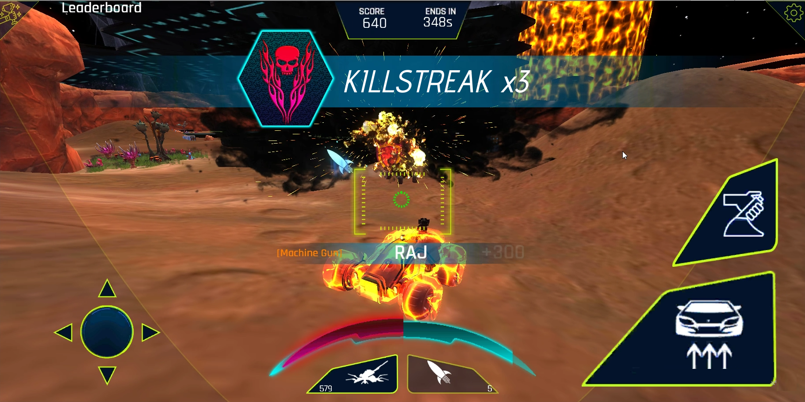
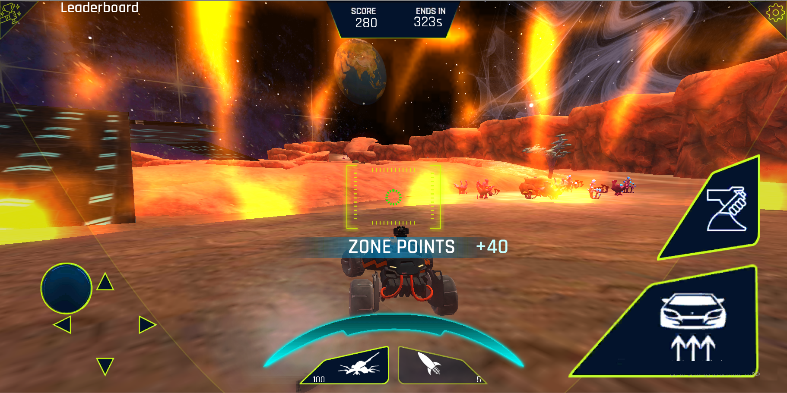

# MarsManiac

.png)

*Link to apk* : https://drive.google.com/drive/folders/1wwhKZgdCK4ph3MZMa4P0FmwbbW_uqyP_?usp=sharing

A multiplayer shooter game on wheels, designed as a project to help implement multiplayer functionality in Android.  

Photon Plugin has been used to achieve the multiplayer functionality, along with authentication from Facebook for Login purposes. Firebase has been used as a realtime-database for storing player information, including ranks.  

The game also features AI Cars to replace humans incase of shortage of players in a match. The AI makes use of Raycasts, Unity ML agents and NavMesh AI.

>*Cover*

---
>*Main Menu*

---
>*The crosshair follows enemy cars as long as it is within the rectangular hitbox area*

---
>*Health Pickups and screen effects*

---
>*Killstreaks*

---
>*Being inside yellow beacon zones grants extra points*

